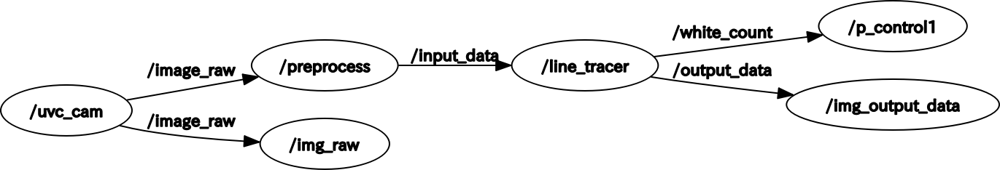

Linetracer ver.ROS1
==
## 概要
- 若槻くんが作成したline_tracer.cppをROS1に移植しました．
  - 全ての機能を移植したわけではありません．
- 以前に自分が作成したFAST特徴点検出を行うROSシステムを基に作成しました．

## ノード構成
- ノードの説明
  - uvc_camera: カメラ画像の配信を行うノード．ROSのコミュニティで公開されているもの．
  - preprocess: 入力画像のりサイズを行い，配信するノードです．引数でサイズ指定可能．
  - linetracer: 画像のあるラインを見て，そのラインの白画素をカウントします．カウントした白画素の数を配信します．またデバッグ様に/output_dataに処理画像を配信しています．
    - *listに関する処理は未実装です*
  - p_control: 白画素の数を購読します．
    - *制御に関する部分は未実装のため，現在は標準出力に受信した白画素数を表示している*



## msg型
- image_raw， input_data, output_data: sensor_msg/image_raw
- white_count: int32型１つ．　/linetracer/white_pixel.hで定義．

## 必要な外部パッケージ
おそらく下記の3つです．
- image_transport
- cv_bridge
- uvc_camera

## 起動方法
launchを使用して起動できます．launchファイルは/linetracerにあります．引数のwidth, heightはリサイズのサイズ指定です．

```
roslaunch line_tracer line_tracer.launch width:=640 height:=480
```
